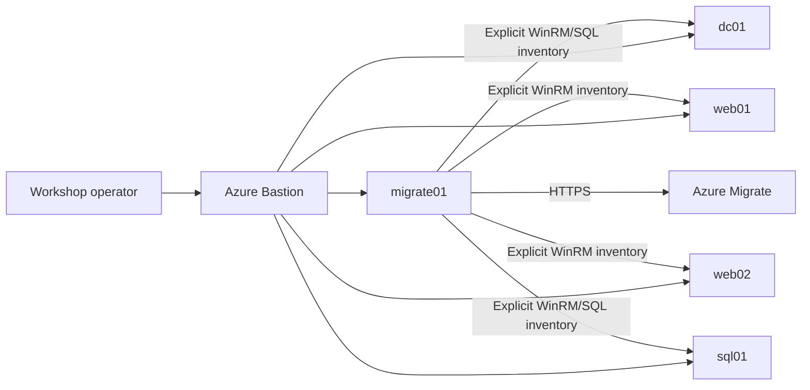
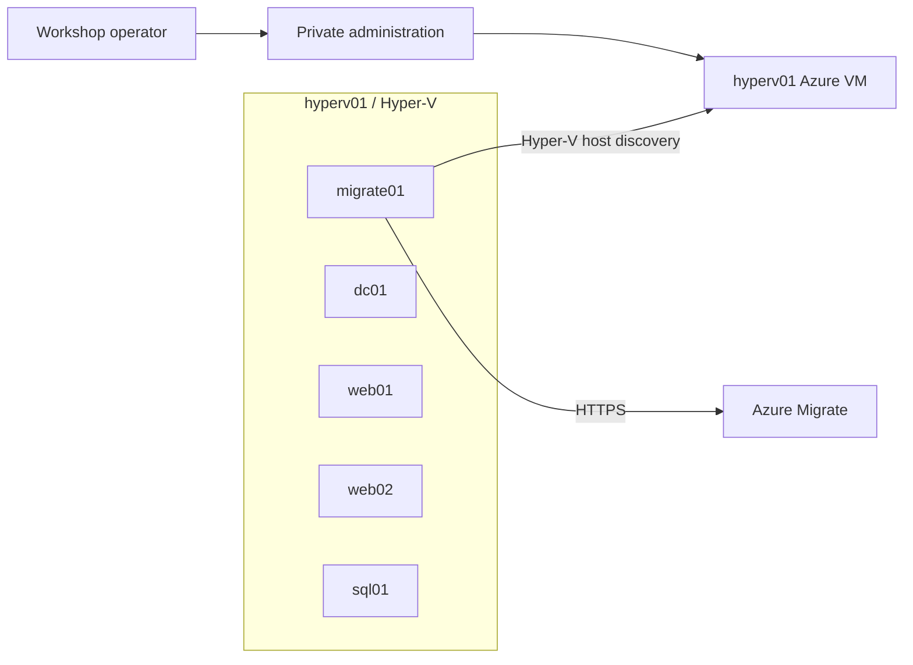
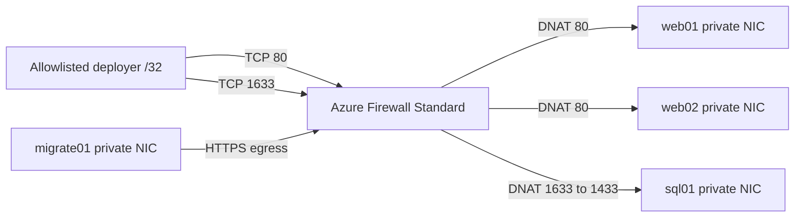

# Source-estate architectures

All scenarios create the same logical source estate: `dc01`, `web01`, `web02`,
`sql01`, and `migrate01`. They differ in where those machines run and how Azure
Migrate discovers them.

## Azure-native scenario

Each role is an Azure VM with no workload public IP. Azure Migrate uses the
physical-server workflow: it receives each source FQDN/IP explicitly or through
the generated CSV. It does not scan the VNet.

Default Azure subnets remain:

| Subnet | CIDR | Workloads |
|---|---:|---|
| `AzureBastionSubnet` | `10.50.0.0/26` | Azure Bastion |
| `snet-management` | `10.50.1.0/24` | `migrate01` |
| `snet-identity` | `10.50.2.0/24` | `dc01` |
| `snet-web` | `10.50.3.0/24` | `web01`, `web02` |
| `snet-data` | `10.50.4.0/24` | `sql01` |

## Nested-virtualization scenario

Azure contains one nested-virtualization-capable Windows Server Datacenter host.
The five logical machines run as private inner Hyper-V VMs on an internal switch
with controlled NAT egress. Azure Migrate uses the Hyper-V workflow and queries
the outer host to enumerate the inner source VMs. This is more realistic and
more resource-intensive than the Azure-native scenario.

The nested deployment fails closed if the selected Azure SKU does not expose
nested virtualization or cannot satisfy the configured CPU, memory, disk, image,
and quota requirements. Guest and appliance media are user-supplied approved
inputs and are never committed to the repository.

## Public-firewall scenario

Azure Firewall owns three Standard public IPs so both web servers can retain
public TCP 80 while remaining separate endpoints. SQL is presented externally
on TCP 1633 and translated to its internal TCP 1433 listener. DNAT and NSG rules
accept only the required deployer CIDR. VM NICs have no public IPs and RDP is
not exposed. Workload default routes send controlled egress through the
firewall.

## Shared logical flows

| Source | Destination | Ports | Reason |
|---|---|---:|---|
| Domain members | `dc01` | DNS 53, Kerberos 88, LDAP 389, SMB 445, RPC 135/dynamic RPC | Domain services |
| `migrate01` | discovered Windows servers | TCP 5986 | Secure Windows inventory |
| `migrate01` | `sql01` | TCP 1433 | SQL discovery |
| `web01`, `web02` | `sql01` | TCP 1433 | Application data |
| `dc01` | `web01`, `web02` | TCP 80/443 | Synthetic workload |
| Appliance | Azure Migrate | TCP 443 | Metadata upload |

## Shared bootstrap order

1. Provision scenario-specific Azure infrastructure.
2. Prepare machine shells and private management connectivity.
3. Configure `dc01` with AD DS/DNS, then AD CS.
4. Join `web01`, `web02`, `sql01`, and `migrate01`.
5. Configure WinRM HTTPS, SQL, IIS, the application, discovery identities, and
   synthetic traffic.
6. Validate all roles before appliance registration.
7. Register the appliance interactively and use the scenario's discovery mode.

Every phase must be restartable and fail with an actionable prerequisite error.
No workflow stores appliance registration material in source or claims that
interactive registration is automated.

## Cost and reliability posture

All scenarios are ephemeral workshops, not production systems. The Azure-native
scenario incurs five VM, Bastion, NAT, disk, and related charges. The nested
scenario reduces Azure VM count but requires a much larger nested-capable host
and enough disks/memory for all inner VMs, including the Azure Migrate appliance.
The public-firewall scenario adds one of the lab's largest fixed hourly costs
plus three Standard public IPs.
Auto-shutdown does not remove disks, networking, or other billable resources;
resource-group teardown remains mandatory.
